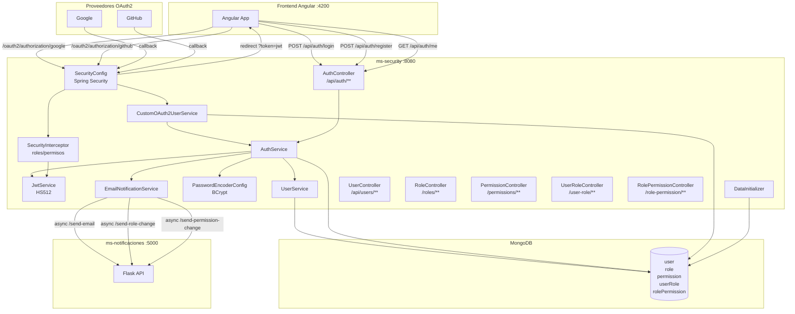
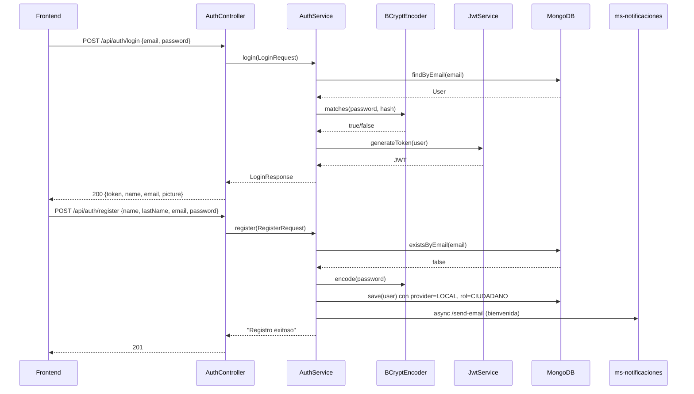
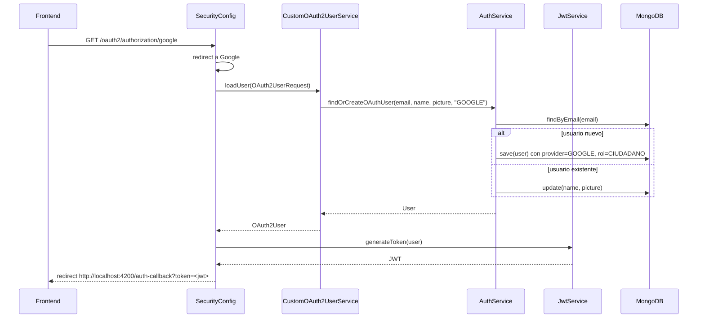

# Diseño Técnico: Unificación backend → ms-security

## Visión General

Este documento describe el diseño técnico para unificar el módulo `backend` (Spring Boot 3.2, autenticación OAuth2 + email/contraseña) dentro de `ms-security` (Spring Boot 4.0.3, gestión de roles/permisos/JWT). El resultado es un único microservicio `ms-security` que centraliza toda la autenticación y la gestión de roles y permisos.

La migración implica:
- Bajar la versión de Spring Boot de 4.0.3 a 3.4.5 (compatibilidad con OAuth2 + jjwt 0.11.5)
- Incorporar el flujo OAuth2 (Google, GitHub) y el `AuthController` del `backend`
- Reemplazar SHA-256 por BCrypt
- Ampliar el modelo `User` con campos OAuth2
- Mantener intacto el sistema de roles/permisos/interceptor existente

El módulo `backend` queda obsoleto como servicio activo; `ms-security` en el puerto 8080 es el único punto de autenticación.

---

## Arquitectura

### Diagrama de componentes



### Flujo de autenticación email/contraseña



### Flujo OAuth2



---

## Componentes e Interfaces

### Componentes nuevos (a crear en ms-security)

#### `PasswordEncoderConfig`
```
package: com.sho.ms_security.configurations
Bean: BCryptPasswordEncoder (factor coste 10)
```

#### `AuthService`
```
package: com.sho.ms_security.services
Métodos:
  - login(LoginRequest) → LoginResponse
  - register(RegisterRequest) → String (mensaje)
  - findOrCreateOAuthUser(email, name, picture, provider) → User
  - changePassword(User, oldPassword, newPassword) → String
  - getUserFromToken(String token) → User
```

#### `AuthController`
```
package: com.sho.ms_security.controllers
Endpoints:
  - POST  /api/auth/login          → público
  - POST  /api/auth/register       → público
  - GET   /api/auth/me             → requiere JWT válido
  - POST  /api/auth/change-password → requiere JWT válido
```

#### `CustomOAuth2UserService`
```
package: com.sho.ms_security.configurations
Extiende: DefaultOAuth2UserService
Maneja: Google (email, name, picture) y GitHub (login, avatar_url, email sintético)
Llama: authService.findOrCreateOAuthUser()
```

#### `SecurityConfig`
```
package: com.sho.ms_security.configurations
Configura:
  - CORS: orígenes http://localhost:*, http://127.0.0.1:*
  - CSRF deshabilitado para /api/**
  - Rutas públicas: POST /api/auth/register, POST /api/auth/login, /oauth2/**, /login/oauth2/**
  - OAuth2 login con CustomOAuth2UserService
  - Success handler: genera JWT y redirige a http://localhost:4200/auth-callback?token=<jwt>
  - Sesión: timeout 30m, cookie same-site=lax
```

#### DTOs nuevos
```
RegisterRequest: name(@NotBlank,@Size(2,50)), lastName(@NotBlank,@Size(2,50)),
                 email(@NotBlank,@Email), password(@NotBlank,@Size(min=8),@Pattern)
LoginRequest:    email(@NotBlank), password(@NotBlank)
LoginResponse:   message, token, name, email, picture
```

### Componentes modificados

#### `User` (modelo)
Campos a agregar:
- `lastName` (String)
- `picture` (String)
- `provider` (String: "LOCAL", "GOOGLE", "GITHUB")
- `@Indexed(unique = true)` en `email`
- `@Document(collection = "user")` explícito

#### `UserService`
- Reemplazar `EncryptionService.convertSHA256()` por `BCryptPasswordEncoder.encode()`
- Inyectar `PasswordEncoder` en lugar de `EncryptionService`

#### `SecurityService`
- Reemplazar `encryptionService.convertSHA256()` por `passwordEncoder.matches()`
- Nota: `SecurityService` queda como legacy; el nuevo flujo usa `AuthService`

#### `UserRepository`
Métodos a agregar:
- `Optional<User> findByEmail(String email)`
- `boolean existsByEmail(String email)`

#### `EmailNotificationService`
Método a agregar:
- `sendWelcomeEmail(String email, String name)` → llama `/send-email` en ms-notificaciones

#### `WebConfig`
Exclusiones a agregar en `addInterceptors()`:
- `/api/auth/register`
- `/api/auth/login`
- `/api/auth/me`
- `/api/auth/change-password`

### Componentes a eliminar

| Componente | Motivo |
|---|---|
| `EncryptionService.java` | Reemplazado por BCryptPasswordEncoder |
| `SecurityController.java` | Reemplazado por AuthController |

### Componentes sin cambios

- `SecurityInterceptor` — sigue manejando autorización por roles/permisos
- `ValidatorsService` — sin cambios
- `JwtService` — `getUserFromToken()` ya funciona correctamente
- `DataInitializer` — roles y permisos predeterminados ya están implementados
- `RoleController`, `PermissionController`, `UserRoleController`, `RolePermissionController`
- `UserController` (`/api/users/**`)
- `ms-notificaciones` (Flask) — sin cambios

---

## Modelos de Datos

### User (colección `user`)

```
{
  _id:       ObjectId,
  name:      String (requerido),
  lastName:  String (opcional, null para OAuth2 sin apellido),
  email:     String (único, indexado),
  password:  String (BCrypt hash, null para OAuth2),
  picture:   String (URL, null para LOCAL sin foto),
  provider:  String ("LOCAL" | "GOOGLE" | "GITHUB")
}
```

**Cambio de colección**: el `backend` usaba `users` (plural); `ms-security` usa `user` (singular). Los usuarios del `backend` no se migran automáticamente — son bases de datos separadas.

### Role (colección `role`)
Sin cambios. Campos: `id`, `name`, `description`.

### Permission (colección `permission`)
Sin cambios. Campos: `id`, `url`, `method`, `model`.

### UserRole (colección `userRole`)
Sin cambios. Campos: `id`, `@DBRef user`, `@DBRef role`.

### RolePermission (colección `rolePermission`)
Sin cambios. Campos: `id`, `@DBRef role`, `@DBRef permission`.

### DTOs (no persistidos)

```java
// RegisterRequest
{
  name:     String @NotBlank @Size(min=2, max=50)
  lastName: String @NotBlank @Size(min=2, max=50)
  email:    String @NotBlank @Email
  password: String @NotBlank @Size(min=8) @Pattern(regexp="^(?=.*[a-z])(?=.*[A-Z])(?=.*\\d)(?=.*[^A-Za-z0-9]).{8,}$")
}

// LoginRequest
{
  email:    String @NotBlank
  password: String @NotBlank
}

// LoginResponse
{
  message: String
  token:   String (JWT)
  name:    String
  email:   String
  picture: String (puede ser null)
}
```

### Configuración `application.properties` (adiciones)

```properties
# OAuth2 Google
spring.security.oauth2.client.registration.google.client-id=${GOOGLE_CLIENT_ID}
spring.security.oauth2.client.registration.google.client-secret=${GOOGLE_CLIENT_SECRET}
spring.security.oauth2.client.registration.google.scope=email,profile,openid
spring.security.oauth2.client.registration.google.redirect-uri=http://localhost:8080/login/oauth2/code/google

# OAuth2 GitHub
spring.security.oauth2.client.registration.github.client-id=${GITHUB_CLIENT_ID}
spring.security.oauth2.client.registration.github.client-secret=${GITHUB_CLIENT_SECRET}
spring.security.oauth2.client.registration.github.scope=user:email,read:user
spring.security.oauth2.client.registration.github.redirect-uri=http://localhost:8080/login/oauth2/code/github

# Sesión
server.servlet.session.timeout=30m
server.servlet.session.cookie.same-site=lax

# Frontend
frontend.url=http://localhost:4200
```

---


## Propiedades de Corrección

*Una propiedad es una característica o comportamiento que debe mantenerse verdadero en todas las ejecuciones válidas del sistema — esencialmente, una declaración formal sobre lo que el sistema debe hacer. Las propiedades sirven como puente entre las especificaciones legibles por humanos y las garantías de corrección verificables por máquina.*

---

### Propiedad 1: BCrypt round-trip

*Para cualquier* contraseña en texto plano, codificarla con `BCryptPasswordEncoder.encode()` y luego verificarla con `BCryptPasswordEncoder.matches(password, hash)` debe retornar `true`.

**Valida: Requisitos 2.1, 2.2**

---

### Propiedad 2: Persistencia de campos ampliados del modelo User

*Para cualquier* objeto `User` con los campos `name`, `lastName`, `email`, `password`, `picture` y `provider` establecidos, guardarlo en MongoDB y recuperarlo por id debe producir un objeto con los mismos valores en todos esos campos.

**Valida: Requisitos 3.1, 3.2**

---

### Propiedad 3: Provider correcto según tipo de registro

*Para cualquier* registro local (email/contraseña), el campo `provider` del usuario creado debe ser `"LOCAL"`. *Para cualquier* autenticación OAuth2 con Google o GitHub, el campo `provider` debe ser `"GOOGLE"` o `"GITHUB"` respectivamente.

**Valida: Requisitos 3.3, 3.4, 8.3, 9.4**

---

### Propiedad 4: Registro exitoso crea usuario con BCrypt

*Para cualquier* conjunto de datos de registro válidos (name, lastName, email, password que cumplan las validaciones), el endpoint `POST /api/auth/register` debe crear el usuario en MongoDB con la contraseña almacenada como hash BCrypt (no en texto plano), retornar HTTP 201, y permitir un login exitoso posterior con esas mismas credenciales.

**Valida: Requisitos 4.1, 4.9, 5.1**

---

### Propiedad 5: Validación de campos rechaza entradas inválidas

*Para cualquier* solicitud de registro o cambio de contraseña donde algún campo no cumpla las restricciones (name/lastName fuera de [2,50] caracteres, email con formato inválido, contraseña sin mayúscula/minúscula/dígito/carácter especial o menor a 8 caracteres), el sistema debe retornar HTTP 400 y no crear ni modificar ningún usuario en la base de datos.

**Valida: Requisitos 4.2, 4.3, 4.4, 4.5, 4.7, 7.2**

---

### Propiedad 6: Email duplicado retorna 409

*Para cualquier* email ya registrado en la base de datos, un segundo intento de registro con ese mismo email debe retornar HTTP 409 con el mensaje `"Ya existe una cuenta con ese email"`, sin crear un segundo documento en MongoDB.

**Valida: Requisito 4.6**

---

### Propiedad 7: Rol CIUDADANO asignado automáticamente al registrarse

*Para cualquier* registro exitoso (tanto por email/contraseña como por OAuth2 con usuario nuevo), el usuario creado debe tener una relación `UserRole` con el rol `CIUDADANO` en MongoDB.

**Valida: Requisitos 4.10, 8.3, 9.4**

---

### Propiedad 8: JWT contiene los claims correctos

*Para cualquier* usuario con `id`, `name` y `email` definidos, el token JWT generado por `JwtService.generateToken()` debe contener exactamente esos tres valores en los claims correspondientes, y `JwtService.getUserFromToken()` debe recuperar un `User` con los mismos valores.

**Valida: Requisito 5.2**

---

### Propiedad 9: Credenciales inválidas retornan 401 genérico

*Para cualquier* combinación de email inexistente o contraseña incorrecta, el endpoint `POST /api/auth/login` debe retornar HTTP 401 con el mensaje genérico `"Credenciales inválidas"`, sin indicar cuál de los dos campos es incorrecto.

**Valida: Requisitos 5.3, 6.2**

---

### Propiedad 10: Normalización de email a minúsculas

*Para cualquier* email que contenga letras mayúsculas, el sistema debe tratarlo como equivalente a su versión en minúsculas tanto en el registro como en el login (un usuario registrado con `"Usuario@Email.COM"` debe poder hacer login con `"usuario@email.com"`).

**Valida: Requisito 5.5**

---

### Propiedad 11: /me retorna datos del usuario sin exponer password

*Para cualquier* usuario autenticado con un JWT válido, el endpoint `GET /api/auth/me` debe retornar los campos `id`, `name`, `lastName`, `email`, `picture` y `provider`, y el campo `password` no debe estar presente en la respuesta bajo ningún nombre o alias.

**Valida: Requisitos 6.1, 6.3**

---

### Propiedad 12: Cambio de contraseña round-trip

*Para cualquier* usuario LOCAL con contraseña válida, después de un cambio de contraseña exitoso, el login con la contraseña antigua debe fallar (HTTP 401) y el login con la nueva contraseña debe tener éxito (HTTP 200 con JWT).

**Valida: Requisitos 7.1, 7.5**

---

### Propiedad 13: Contraseña actual incorrecta bloquea el cambio

*Para cualquier* usuario LOCAL, si la contraseña actual proporcionada en `POST /api/auth/change-password` no coincide con el hash almacenado, el sistema debe retornar HTTP 400 con el mensaje `"Contraseña actual incorrecta"` y no modificar la contraseña en la base de datos.

**Valida: Requisito 7.3**

---

### Propiedad 14: Usuarios OAuth2 no pueden cambiar contraseña

*Para cualquier* usuario cuyo campo `provider` sea `"GOOGLE"` o `"GITHUB"`, el endpoint `POST /api/auth/change-password` debe retornar HTTP 400 con el mensaje `"Los usuarios OAuth2 no pueden cambiar contraseña desde aquí"`, sin modificar ningún dato.

**Valida: Requisito 7.4**

---

### Propiedad 15: OAuth2 actualiza datos de usuario existente

*Para cualquier* usuario ya registrado en MongoDB, cuando se autentica vía OAuth2 con el mismo email, el sistema debe actualizar los campos `name` y `picture` con los valores del proveedor, sin crear un documento duplicado ni cambiar el `provider` original.

**Valida: Requisitos 8.4, 9.5**

---

### Propiedad 16: Email sintético para GitHub con email privado

*Para cualquier* usuario de GitHub cuyo atributo `email` sea nulo o vacío, el sistema debe construir un email sintético con el formato `<login>@github.user`, donde `<login>` es el atributo `login` del usuario de GitHub.

**Valida: Requisito 9.3**

---

### Propiedad 17: Eliminación de rol con usuarios asignados retorna 409

*Para cualquier* rol que tenga al menos un usuario asignado (relación `UserRole` existente), el intento de eliminación vía `DELETE /roles/{id}` debe retornar HTTP 409 con el mensaje `"No se puede eliminar el rol: tiene usuarios asignados"`, sin eliminar el rol de la base de datos.

**Valida: Requisitos 10.4, 10.5**

---

### Propiedad 18: Asignación de relaciones usuario-rol y rol-permiso es persistente

*Para cualquier* par válido (userId, roleId) o (roleId, permissionId), después de crear la relación mediante el endpoint correspondiente, una consulta posterior debe retornar esa relación. La operación es idempotente en cuanto a la existencia del dato.

**Valida: Requisitos 12.1, 13.1**

---

### Propiedad 19: Permisos de múltiples roles se acumulan

*Para cualquier* usuario con N roles asignados, el conjunto de permisos efectivos evaluados por el `SecurityInterceptor` debe ser la unión de los permisos de todos sus roles. Si el permiso requerido existe en al menos uno de sus roles, el acceso debe ser concedido.

**Valida: Requisito 12.2**

---

### Propiedad 20: Recurso inexistente retorna 404

*Para cualquier* operación de asignación (usuario-rol o rol-permiso) donde el userId, roleId o permissionId no exista en la base de datos, el sistema debe retornar HTTP 404 con un mensaje descriptivo, sin crear relaciones huérfanas.

**Valida: Requisitos 12.4, 13.4**

---

### Propiedad 21: Endpoints públicos accesibles sin autenticación

*Para cualquier* petición a `POST /api/auth/register`, `POST /api/auth/login`, `GET /oauth2/authorization/**` o `GET /login/oauth2/code/**`, el sistema debe procesar la solicitud sin requerir token JWT ni rechazarla con HTTP 401 por falta de autenticación.

**Valida: Requisito 14.3**

---

### Propiedad 22: Endpoints protegidos requieren token válido

*Para cualquier* endpoint bajo `/api/**` que no esté en la lista de exclusiones del `SecurityInterceptor`, una petición sin header `Authorization: Bearer <token>` o con un token inválido/expirado debe retornar HTTP 401.

**Valida: Requisito 14.4**

---

### Propiedad 23: Resiliencia ante fallo de ms-notificaciones

*Para cualquier* operación que dispare una notificación asíncrona (registro, cambio de rol, cambio de permisos), si ms-notificaciones no está disponible o retorna error, la operación principal debe completarse exitosamente y retornar la respuesta correcta al cliente, sin propagar la excepción.

**Valida: Requisito 15.3**

---

## Manejo de Errores

### Estrategia general

Todos los errores se retornan como JSON con el campo `message` (o `error` para errores del interceptor). No se exponen stack traces ni detalles internos al cliente.

### Tabla de errores por componente

| Componente | Condición | HTTP | Mensaje |
|---|---|---|---|
| AuthController | Email duplicado en registro | 409 | "Ya existe una cuenta con ese email" |
| AuthController | Validación de campos fallida | 400 | Mensajes de validación por campo |
| AuthController | Credenciales inválidas en login | 401 | "Credenciales inválidas" |
| AuthController | Token inválido/expirado en /me | 401 | "No autorizado: token inválido o sin permisos" |
| AuthController | Contraseña actual incorrecta | 400 | "Contraseña actual incorrecta" |
| AuthController | Usuario OAuth2 intenta cambiar contraseña | 400 | "Los usuarios OAuth2 no pueden cambiar contraseña desde aquí" |
| SecurityInterceptor | Sin token o token inválido | 401 | "No autorizado: token inválido o sin permisos" |
| RoleController | Rol con usuarios asignados | 409 | "No se puede eliminar el rol: tiene usuarios asignados" |
| UserRoleController | Usuario o rol inexistente | 404 | Mensaje descriptivo |
| RolePermissionController | Rol o permiso inexistente | 404 | Mensaje descriptivo |
| EmailNotificationService | ms-notificaciones no disponible | — | Log de error, operación continúa |
| CustomOAuth2UserService | Error en flujo OAuth2 | 500 | Manejado por Spring Security |

### Manejo de errores en JwtService

El `JwtService` usa una clave generada en memoria (`Keys.secretKeyFor(HS512)`). Esto implica que los tokens se invalidan al reiniciar el servicio. Para producción se recomienda usar `jwt.secret` como clave fija desde `application.properties`.

### Compatibilidad SHA-256 → BCrypt

Los usuarios registrados con SHA-256 (si existieran en la misma base de datos) no podrán hacer login tras la migración, ya que `BCryptPasswordEncoder.matches()` retornará `false` para hashes SHA-256. El sistema retornará HTTP 401 con mensaje genérico, sin revelar el motivo. La migración de contraseñas existentes requiere un proceso de reset de contraseña fuera del alcance de este diseño.

---

## Estrategia de Testing

### Enfoque dual: tests unitarios + tests basados en propiedades

Ambos tipos son complementarios y necesarios para cobertura completa:
- **Tests unitarios**: verifican ejemplos específicos, casos borde y condiciones de error
- **Tests de propiedades**: verifican propiedades universales sobre espacios de entrada amplios

### Librería de property-based testing

Para Java/Spring Boot se usará **[jqwik](https://jqwik.net/)** (versión 1.8.x), que se integra con JUnit 5 y es compatible con Spring Boot Test.

Dependencia a agregar en `pom.xml` (scope test):
```xml
<dependency>
    <groupId>net.jqwik</groupId>
    <artifactId>jqwik</artifactId>
    <version>1.8.5</version>
    <scope>test</scope>
</dependency>
```

### Configuración de tests de propiedades

- Mínimo **100 iteraciones** por test de propiedad (`@Property(tries = 100)`)
- Cada test debe referenciar la propiedad del diseño con un comentario:
  ```java
  // Feature: backend-ms-security-unification, Propiedad N: <texto de la propiedad>
  ```
- Cada propiedad de corrección debe implementarse con **un único test de propiedad**

### Tests unitarios (ejemplos específicos)

Enfocados en:
- Arranque del contexto de Spring (Requisito 1.5)
- Bean `PasswordEncoder` de tipo BCrypt disponible en contexto (Requisito 2.3)
- Extracción de atributos OAuth2 de Google y GitHub (Requisitos 8.2, 9.2)
- `DataInitializer` crea roles, permisos y asignaciones al arrancar (Requisitos 10.1, 10.2, 10.3)
- Headers CORS correctos en respuestas (Requisito 14.1)
- CSRF deshabilitado para `/api/**` (Requisito 14.2)
- Llamada asíncrona a ms-notificaciones al registrarse (Requisitos 4.8, 15.2)
- Notificación de cambio de rol enviada (Requisito 12.3)

### Tests de propiedades (por propiedad del diseño)

| Propiedad | Generadores necesarios | Patrón |
|---|---|---|
| P1: BCrypt round-trip | Strings arbitrarios (contraseñas) | Round-trip |
| P2: Persistencia User | Objetos User con campos aleatorios | Round-trip |
| P3: Provider correcto | Tipo de registro (LOCAL/GOOGLE/GITHUB) | Invariante |
| P4: Registro exitoso | RegisterRequest válidos | Round-trip |
| P5: Validación rechaza inválidos | Entradas fuera de restricciones | Error condition |
| P6: Email duplicado → 409 | Emails registrados | Invariante |
| P7: Rol CIUDADANO asignado | Registros exitosos | Invariante |
| P8: JWT claims correctos | Objetos User | Round-trip |
| P9: Credenciales inválidas → 401 | Emails/contraseñas incorrectos | Error condition |
| P10: Normalización email | Emails con mayúsculas | Metamórfica |
| P11: /me sin password | Usuarios autenticados | Invariante |
| P12: Cambio contraseña round-trip | Usuarios LOCAL + contraseñas válidas | Round-trip |
| P13: Contraseña incorrecta → 400 | Contraseñas incorrectas | Error condition |
| P14: OAuth2 no cambia contraseña | Usuarios GOOGLE/GITHUB | Invariante |
| P15: OAuth2 actualiza usuario | Usuarios existentes + datos OAuth2 | Idempotencia |
| P16: Email sintético GitHub | Logins de GitHub + emails nulos | Invariante |
| P17: Rol con usuarios → 409 | Roles con UserRole asignados | Error condition |
| P18: Relaciones persistentes | Pares userId-roleId válidos | Round-trip |
| P19: Permisos acumulados | Usuarios con N roles | Metamórfica |
| P20: Recurso inexistente → 404 | IDs inexistentes | Error condition |
| P21: Endpoints públicos | Peticiones sin token | Invariante |
| P22: Endpoints protegidos | Peticiones sin/con token inválido | Invariante |
| P23: Resiliencia ms-notificaciones | Fallo simulado de ms-notificaciones | Error condition |

### Cobertura mínima esperada

- Todas las propiedades del diseño deben tener al menos un test de propiedad
- Los casos borde (SHA-256 legacy, email privado GitHub, usuario OAuth2 sin apellido) deben cubrirse con tests unitarios específicos
- Los tests de integración con OAuth2 real (Google, GitHub) se realizan manualmente en entorno de desarrollo
